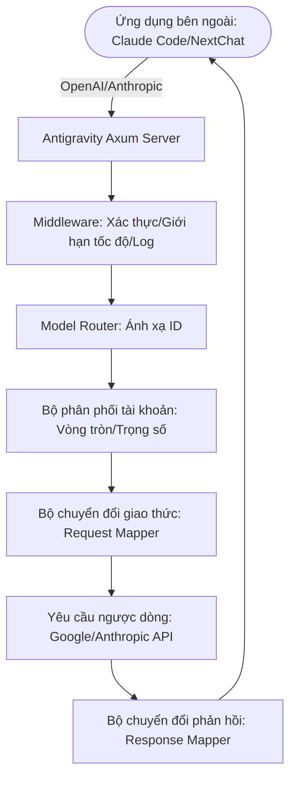

# Antigravity Tools 🚀

<div align="center">
  

  <h3>Cổng điều phối AI hiệu suất cao cá nhân của bạn</h3>
  <p>Không chỉ là quản lý tài khoản, mà còn là giải pháp tối ưu để phá vỡ rào cản gọi API.</p>
  
  <p>
    <a href="https://github.com/lbjlaq/Antigravity-Manager">
      
    </a>
    
    
    
    
  </p>

  <p>
    <a href="#-tính-năng-cốt-lõi">Tính năng cốt lõi</a> • 
    <a href="#-giao-diện">Giao diện</a> • 
    <a href="#-kiến-trúc-kỹ-thuật">Kiến trúc kỹ thuật</a> • 
    <a href="#-hướng-dẫn-cài-đặt">Hướng dẫn cài đặt</a> • 
    <a href="#-kết-nối-nhanh">Kết nối nhanh</a>
  </p>

  <p>
    <strong>Tiếng Việt</strong> | 
    <a href="./README_EN.md">English</a>
  </p>
</div>

---

**Antigravity Tools** là một ứng dụng máy tính để bàn đầy đủ tính năng được thiết kế cho các nhà phát triển và những người đam mê AI. Nó kết hợp hoàn hảo việc quản lý đa tài khoản, chuyển đổi giao thức và điều phối yêu cầu thông minh, mang đến cho bạn một **trạm trung chuyển AI cục bộ** ổn định, cực nhanh và chi phí thấp.

Thông qua ứng dụng này, bạn có thể chuyển đổi Session Web thông thường (Google/Anthropic) thành các giao diện API tiêu chuẩn, loại bỏ hoàn toàn khoảng cách giao thức giữa các nhà cung cấp khác nhau.

## 🌟 Phân tích tính năng chuyên sâu (Detailed Features)

### 1. 🎛️ Bảng điều khiển tài khoản thông minh (Smart Dashboard)
*   **Giám sát thời gian thực toàn cầu**: Nhìn thoáng qua tình trạng sức khỏe của tất cả các tài khoản, bao gồm **hạn ngạch còn lại trung bình** của Gemini Pro, Gemini Flash, Claude và Gemini Drawing.
*   **Đề xuất tài khoản tốt nhất (Smart Recommendation)**: Hệ thống sẽ lọc và đề xuất "tài khoản tốt nhất" dựa trên mức độ dư thừa hạn ngạch của tất cả các tài khoản hiện tại theo thời gian thực, hỗ trợ **chuyển đổi một cú nhấp chuột**.
*   **Ảnh chụp nhanh tài khoản hoạt động**: Hiển thị trực quan tỷ lệ phần trăm hạn ngạch cụ thể và thời gian đồng bộ hóa cuối cùng của tài khoản đang hoạt động.

### 2. 🔐 Quản lý tài khoản mạnh mẽ (Account Management)
*   **Ủy quyền OAuth 2.0 (Tự động/Thủ công)**: Khi thêm tài khoản, liên kết ủy quyền có thể sao chép sẽ được tạo trước, hỗ trợ hoàn tất ủy quyền trên bất kỳ trình duyệt nào; sau khi gọi lại thành công, ứng dụng sẽ tự động hoàn tất và lưu (nếu cần, bạn có thể nhấp vào "Tôi đã ủy quyền, tiếp tục" để hoàn tất thủ công).
*   **Nhập đa chiều**: Hỗ trợ nhập Token đơn lẻ, nhập hàng loạt JSON (ví dụ: sao lưu từ các công cụ khác) và di chuyển nóng tự động từ cơ sở dữ liệu phiên bản cũ V1.
*   **Chế độ xem cấp cổng**: Hỗ trợ chuyển đổi chế độ xem kép "Danh sách" và "Lưới". Cung cấp khả năng phát hiện lệnh cấm 403, tự động đánh dấu và bỏ qua các tài khoản có quyền bất thường.

### 3. 🔌 Chuyển đổi giao thức và chuyển tiếp (API Proxy)
*   **Thích ứng toàn giao thức (Multi-Sink)**:
    *   **Định dạng OpenAI**: Cung cấp điểm cuối `/v1/chat/completions`, tương thích với 99% các ứng dụng AI hiện có.
    *   **Định dạng Anthropic**: Cung cấp giao diện `/v1/messages` gốc, hỗ trợ đầy đủ chức năng của **Claude Code CLI** (như chuỗi tư duy, từ nhắc hệ thống).
    *   **Định dạng Gemini**: Hỗ trợ gọi trực tiếp SDK chính thức của Google.
*   **Tự phục hồi trạng thái thông minh**: Khi yêu cầu gặp lỗi `429 (Too Many Requests)` hoặc `401 (Expire)`, backend sẽ kích hoạt **tự động thử lại và luân chuyển im lặng** trong mili giây, đảm bảo hoạt động kinh doanh không bị gián đoạn.

### 4. 🔀 Trung tâm định tuyến mô hình (Model Router)
*   **Ánh xạ theo sê-ri**: Bạn có thể phân loại các ID mô hình gốc phức tạp vào "gia đình quy cách" (ví dụ: định tuyến tất cả các yêu cầu GPT-4 đến `gemini-3-pro-high`).
*   **Chuyển hướng cấp chuyên gia**: Hỗ trợ ánh xạ mô hình cấp biểu thức chính quy tùy chỉnh, kiểm soát chính xác mô hình đích của từng yêu cầu.

### 5. 🎨 Hỗ trợ đa phương thức và Imagen 3
*   **Kiểm soát chất lượng hình ảnh nâng cao**: Hỗ trợ tự động ánh xạ các tham số `size` của OpenAI (như `1024x1024`, `16:9`) sang các quy cách tương ứng của Imagen 3.
*   **Hỗ trợ Body siêu mạnh**: Backend hỗ trợ Payload lên đến **100MB**, dư sức xử lý nhận dạng hình ảnh độ nét cao 4K.

## 📸 Giao diện (GUI Overview)

````carousel

<!-- slide -->

<!-- slide -->

<!-- slide -->

<!-- slide -->

````

## 🏗️ Kiến trúc kỹ thuật (Architecture)

### Tổng quan dự án
Antigravity Tools là một ứng dụng máy tính để bàn hiệu suất cao, đóng vai trò là cổng AI và trình quản lý tài khoản. Nó cho phép người dùng quản lý nhiều tài khoản AI (đặc biệt là Google Gemini và Anthropic Claude), giám sát hạn ngạch và cung cấp proxy API cục bộ giúp chuẩn hóa các giao thức của nhà cung cấp AI khác nhau thành các định dạng phổ biến (OpenAI, Anthropic, Gemini).

### Ngăn xếp công nghệ (Tech Stack)

#### Core Framework
- **Tauri v2**: Ứng dụng được xây dựng bằng Tauri, cung cấp thời gian chạy nhẹ bằng cách tận dụng webview gốc của hệ điều hành và backend Rust.

#### Frontend (UI)
- **Framework**: React 19
- **Build Tool**: Vite 7
- **Ngôn ngữ**: TypeScript
- **Styling**: TailwindCSS, DaisyUI
- **Quản lý trạng thái**: Zustand
- **Routing**: React Router DOM
- **Đa ngôn ngữ**: i18next
- **Biểu đồ**: Recharts

#### Backend (Hệ thống & Logic)
- **Ngôn ngữ**: Rust
- **Server Framework**: Axum (Server backend hiệu suất cao)
- **Cơ sở dữ liệu**: SQLite (Lưu trữ dữ liệu tài khoản cục bộ an toàn)
- **Các mô đun chính**:
    - `proxy`: Xử lý chặn yêu cầu API, dịch giao thức (Mapper) và chuyển tiếp ngược dòng.
    - `models`: Định nghĩa cấu trúc dữ liệu cho tài khoản, cấu hình và payload API.
    - `modules`: Chứa logic cốt lõi cho ghi nhật ký, quản lý khay hệ thống và cấu hình.
    - `commands`: Hiển thị các chức năng Rust cho frontend thông qua cơ chế IPC của Tauri.

### Sơ đồ luồng dữ liệu



##  Hướng dẫn cài đặt (Installation)

### Tùy chọn A: Cài đặt qua Terminal macOS (Khuyên dùng)
Nếu bạn đã cài đặt [Homebrew](https://brew.sh/), bạn có thể cài đặt nhanh bằng các lệnh sau:

```bash
# 1. Đăng ký Tap của kho lưu trữ này
brew tap lbjlaq/antigravity-manager https://github.com/lbjlaq/Antigravity-Manager

# 2. Cài đặt ứng dụng
brew install --cask antigravity-tools
```
# Nếu gặp vấn đề về quyền, hãy sử dụng --no-quarantine
brew install --cask --no-quarantine antigravity
```

### Tùy chọn B: Tải xuống thủ công
Truy cập [GitHub Releases](https://github.com/lbjlaq/Antigravity-Manager/releases) để tải xuống gói tương ứng với hệ thống của bạn:
*   **macOS**: `.dmg` (Hỗ trợ Apple Silicon & Intel)
*   **Windows**: `.msi` hoặc bản di động `.zip`
*   **Linux**: `.deb` hoặc `AppImage`

### 🛠️ Khắc phục sự cố thường gặp (Troubleshooting)

#### macOS báo "Ứng dụng bị hỏng, không thể mở"?
Do cơ chế bảo mật của macOS, các ứng dụng không được tải xuống từ App Store có thể kích hoạt thông báo này. Bạn có thể sửa nhanh theo các bước sau:

1.  **Sửa bằng dòng lệnh** (Khuyên dùng):
    Mở Terminal và chạy lệnh sau:
    ```bash
    sudo xattr -rd com.apple.quarantine "/Applications/Antigravity Tools.app"
    ```
2.  **Mẹo cài đặt Homebrew**:
    Nếu bạn cài đặt bằng brew, bạn có thể thêm tham số `--no-quarantine` để tránh vấn đề này:
    ```bash
    brew install --cask --no-quarantine antigravity
    ```

## 🔌 Ví dụ kết nối nhanh

### 🔐 Quy trình ủy quyền OAuth (Thêm tài khoản)
1. Mở "Accounts / Tài khoản" → "Thêm tài khoản" → "OAuth".
2. Cửa sổ bật lên sẽ tạo trước liên kết ủy quyền trước khi nhấp vào nút; nhấp vào liên kết để sao chép vào khay nhớ tạm hệ thống, sau đó mở bằng trình duyệt bạn muốn và hoàn tất ủy quyền.
3. Sau khi ủy quyền hoàn tất, trình duyệt sẽ mở trang gọi lại cục bộ và hiển thị "✅ Ủy quyền thành công!".
4. Ứng dụng sẽ tự động tiếp tục hoàn tất ủy quyền và lưu tài khoản; nếu không tự động hoàn tất, bạn có thể nhấp vào "Tôi đã ủy quyền, tiếp tục" để hoàn tất thủ công.

> Mẹo: Liên kết ủy quyền chứa cổng gọi lại dùng một lần, vui lòng luôn sử dụng liên kết mới nhất được tạo trong cửa sổ bật lên; nếu ứng dụng không chạy hoặc cửa sổ bật lên đã đóng khi ủy quyền, trình duyệt có thể báo `localhost refused connection`.

### Cách kết nối Claude Code CLI?
1.  Khởi động Antigravity và bật dịch vụ trong trang "API Proxy".
2.  Chạy trong terminal:
```bash
export ANTHROPIC_API_KEY="sk-antigravity"
export ANTHROPIC_BASE_URL="http://127.0.0.1:8045"
claude
```

### Cách kết nối Kilo Code?
1.  **Chọn giao thức**: Khuyên dùng **Giao thức Gemini**.
2.  **Base URL**: Điền `http://127.0.0.1:8045`.
3.  **Lưu ý**: 
    - **Hạn chế giao thức OpenAI**: Khi Kilo Code sử dụng chế độ OpenAI, đường dẫn yêu cầu của nó sẽ chồng chéo tạo ra đường dẫn không chuẩn `/v1/chat/completions/responses`, khiến Antigravity trả về 404. Vì vậy, vui lòng điền Base URL và chọn chế độ Gemini.
    - **Ánh xạ mô hình**: Tên mô hình trong Kilo Code có thể không khớp với cài đặt mặc định của Antigravity. Nếu không thể kết nối, vui lòng thiết lập ánh xạ tùy chỉnh trong trang "Ánh xạ mô hình" và xem **tệp nhật ký** để gỡ lỗi.

### Cách sử dụng trong Python?
```python
import openai

client = openai.OpenAI(
    api_key="sk-antigravity",
    base_url="http://127.0.0.1:8045/v1"
)

response = client.chat.completions.create(
    model="gemini-3-flash",
    messages=[{"role": "user", "content": "Xin chào, hãy giới thiệu bản thân"}]
)
print(response.choices[0].message.content)
```

## 📝 Nhà phát triển và Cộng đồng

*   **Nhật ký thay đổi (Changelog)**:
    *   **v3.3.0 (2025-12-27)**:
        - **Cập nhật quan trọng (Major Updates)**:
            - **Thích ứng sâu Codex CLI & Claude CLI (Cảm ơn nòng cốt @llsenyue PR #93)**: 
                - **Tương thích hoàn toàn Coding Agent**: Thực hiện hỗ trợ hoàn hảo cho Codex CLI, bao gồm thích ứng sâu điểm cuối `/v1/responses` và chuyển đổi thông minh lệnh gọi công cụ shell (SSOP).
                - **Tăng cường suy luận Claude CLI**: Giới thiệu lưu trữ và điền lại `thoughtSignature` toàn cầu, giải quyết triệt để lỗi xác minh chữ ký khi Claude CLI sử dụng các mô hình dòng Gemini 3.
            - **Tái cấu trúc ngăn xếp giao thức OpenAI**:
                - **Thêm giao diện Completions**: Hỗ trợ đầy đủ định tuyến `/v1/completions` và `/v1/responses`, tương thích với nhiều ứng dụng khách OpenAI truyền thống hơn.
                - **Hợp nhất đa phương thức và làm sạch Schema**: Tích hợp thành công logic phân tích hình ảnh hiệu suất cao tự phát triển và chiến lược lọc JSON Schema độ chính xác cao do cộng đồng đóng góp.
            - **Kiểm soát ràng buộc mạng ưu tiên quyền riêng tư (Cảm ơn nòng cốt @kiookp PR #91)**:
                - **Mặc định Loopback cục bộ**: Máy chủ proxy ngược mặc định lắng nghe `127.0.0.1`, chỉ cho phép truy cập cục bộ, đảm bảo an toàn quyền riêng tư.
                - **Truy cập LAN tùy chọn**: Thêm công tắc cấu hình `allow_lan_access`, sau khi bật sẽ lắng nghe `0.0.0.0` để cho phép thiết bị trong mạng LAN truy cập.
                - **Cảnh báo bảo mật**: Giao diện người dùng cung cấp cảnh báo bảo mật và trạng thái rõ ràng.
        - **Nâng cấp trải nghiệm Frontend**: 
            - **Trực quan hóa điểm cuối đa giao thức**: Thêm hiển thị chi tiết điểm cuối trong trang Proxy API, hỗ trợ sao chép nhanh độc lập cho các điểm cuối Chat/Completions/Responses khác nhau.
    *   **v3.2.8 (2025-12-26)**:
        - **Sửa lỗi (Bug Fixes)**:
            - **Hỗ trợ đa phương thức và mô hình hình ảnh giao thức OpenAI**: Đã sửa hoàn toàn lỗi 400 do định dạng `content` không khớp khi gửi yêu cầu hình ảnh đến mô hình thị giác (như `gemini-3-pro-image`) theo giao thức OpenAI.
            - **Bổ sung toàn diện khả năng thị giác**: Hiện tại giao thức OpenAI hỗ trợ tự động phân tích cú pháp hình ảnh Base64 và ánh xạ thành `inlineData` ngược dòng, mang lại khả năng xử lý hình ảnh ngang bằng với giao thức Claude.
    *   **v3.2.7 (2025-12-26)**:
        - **Tính năng mới (New Features)**:
            - **Tự động khởi động khi bật máy**: Đã thêm chức năng tự động khởi động khi bật máy, có thể bật/tắt một lần nhấp trong tab "Chung" của trang cài đặt.
            - **Bộ chọn kích thước trang danh sách tài khoản**: Đã thêm bộ chọn kích thước trang trong thanh phân trang của trang quản lý tài khoản, hỗ trợ chọn trực tiếp số lượng hiển thị trên mỗi trang (10/20/50/100 mục), không cần vào trang cài đặt, nâng cao hiệu quả thao tác hàng loạt.
        - **Sửa lỗi (Bug Fixes)**:
            - **Tăng cường logic dọn dẹp JSON Schema (Tương thích công cụ MCP)**:
                - **Xóa các trường Schema nâng cao**: Đã thêm xóa các trường JSON Schema nâng cao như `propertyNames`, `const`, `anyOf`, `oneOf`, `allOf`, `if/then/else`, `not` thường được công cụ MCP sử dụng nhưng Gemini không hỗ trợ, giải quyết triệt để lỗi 400 khi Claude Code v2.0.76+ sử dụng công cụ MCP.
                - **Tối ưu hóa thứ tự dọn dẹp đệ quy**: Điều chỉnh để dọn dẹp đệ quy các nút con trước rồi mới xử lý nút cha, tránh các đối tượng lồng nhau bị tuần tự hóa sai vào description.
                - **Tương thích loại Protobuf**: Buộc hạ cấp mảng loại hợp nhất (như `["string", "null"]`) thành loại đơn, giải quyết lỗi "Proto field is not repeating".
                - **Nhận dạng trường thông minh**: Tăng cường logic kiểm tra loại, đảm bảo chỉ xóa trường xác thực khi giá trị là loại tương ứng, tránh xóa nhầm định nghĩa thuộc tính có tên `pattern`, v.v.
            - **Sửa lỗi nhập cơ sở dữ liệu tùy chỉnh**: Đã sửa lỗi "Command not found" của chức năng "Nhập từ DB tùy chỉnh" do lệnh `import_custom_db` chưa được đăng ký. Giờ đây người dùng có thể chọn tệp `state.vscdb` đường dẫn tùy chỉnh để nhập tài khoản bình thường.
            - **Ổn định proxy và tối ưu hóa hiệu suất vẽ**:
                - **Cơ chế lùi 429 thông minh**: Tích hợp sâu phân tích `RetryInfo`, tuân thủ chính xác hướng dẫn thử lại của Google API và tăng dự phòng an toàn, giảm hiệu quả rủi ro bị cấm tài khoản.
                - **Phân luồng lỗi chính xác**: Đã sửa logic đánh giá sai giới hạn tần suất là cạn kiệt hạn quạch (không còn giết nhầm báo lỗi chứa "check quota"), đảm bảo có thể tự động chuyển tài khoản khi bị giới hạn dòng.
                - **Tăng tốc đồng thời yêu cầu vẽ**: Vô hiệu hóa khóa cửa sổ thời gian 60 giây cho các yêu cầu loại `image_gen`, thực hiện luân chuyển tài khoản cực nhanh, giải quyết triệt để vấn đề báo lỗi 429 khi vẽ.
    *   **v3.2.6 (2025-12-26)**:
        - **Sửa lỗi nghiêm trọng (Critical Fixes)**:
            - **Tối ưu hóa sâu giao thức Claude (Tăng cường trải nghiệm Claude Code)**:
                - **Ánh xạ danh tính động**: Tự động tiêm bản vá bảo vệ danh tính dựa trên mô hình yêu cầu, khóa danh tính gốc Anthropic, chặn nhiễu lệnh từ nền tảng trung chuyển bên dưới.
                - **Bù đắp đầu ra rỗng của công cụ**: Đối với các lệnh im lặng như `mkdir`, tự động ánh xạ đầu ra rỗng thành tín hiệu thành công rõ ràng, giải quyết vấn đề gián đoạn dòng tác vụ và ảo giác của Claude CLI.
                - **Cấu hình chuỗi dừng toàn cầu**: Tối ưu hóa `stopSequences` cho liên kết proxy, cắt chính xác đầu ra luồng, giải quyết triệt để báo lỗi phân tích cú pháp do dư thừa phần đuôi phản hồi.
                - **Làm sạch Payload thông minh (Smart Panic Fix)**: Giới thiệu kiểm tra loại trừ lẫn nhau giữa `GoogleSearch` và `FunctionCall`, và tự động tách tải công cụ khi chuyển hướng tác vụ nền (Token Saver), loại bỏ hoàn toàn lỗi **400 Xung đột công cụ (Multiple tools)**.
                - **Tăng cường ổn định proxy (Cảm ơn nòng cốt @salacoste PR #79)**: 
                    - **Lùi thông minh 429**: Hỗ trợ phân tích `RetryInfo` ngược dòng, tự động chờ và thử lại khi kích hoạt giới hạn dòng, giảm đáng kể luân chuyển tài khoản không hợp lệ.
                    - **Cơ chế dự phòng Resume**: Đối với báo lỗi chữ ký không hợp lệ có thể xuất hiện ở `/resume`, thực hiện thử lại lần hai tự động tách khối Thinking, nâng cao tỷ lệ thành công khôi phục phiên.
                    - **Tăng cường chế độ Schema**: Tăng cường logic dọn dẹp đệ quy JSON Schema, và thêm lọc các trường mở rộng như `enumCaseInsensitive`.
            - **Củng cố bộ thử nghiệm**: Đã sửa lỗi thiếu nhập và thuộc tính trùng lặp trong mô đun thử nghiệm `mappers`, và thêm thử nghiệm hợp nhất khối nội dung và hoàn thành đầu ra rỗng.

*   **Giấy phép**: Dựa trên giấy phép **CC BY-NC-SA 4.0**, **nghiêm cấm mọi hình thức hành vi thương mại**.
*   **Tuyên bố bảo mật**: Tất cả dữ liệu tài khoản của ứng dụng này được lưu trữ mã hóa trong cơ sở dữ liệu SQLite cục bộ, trừ khi bật chức năng đồng bộ hóa, dữ liệu sẽ không bao giờ rời khỏi thiết bị của bạn.

---

<div align="center">
  <p>Nếu bạn thấy công cụ này hữu ích, vui lòng cho một ⭐️ trên GitHub</p>
  <p>Copyright © 2025 Antigravity Team.</p>
</div>
