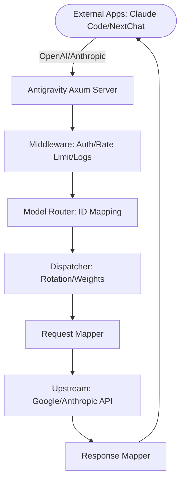

# Antigravity Tools 🚀

<div align="center">
  

  <h3>Your Personal High-Performance AI Dispatch Gateway</h3>
  <p>Seamlessly proxy Gemini & Claude. OpenAI-Compatible. Privacy First.</p>
  
  <p>
    <a href="https://github.com/lbjlaq/Antigravity-Manager">
      
    </a>
    
    
    
    
  </p>

  <p>
    <a href="#-features">Features</a> • 
    <a href="#-gui-overview">GUI Overview</a> • 
    <a href="#-architecture">Architecture</a> • 
    <a href="#-installation">Installation</a> • 
    <a href="#-quick-integration">Integration</a>
  </p>

  <p>
    <a href="./README.md">简体中文</a> | 
    <strong>English</strong>
  </p>
</div>

---

**Antigravity Tools** is an all-in-one desktop application designed for developers and AI enthusiasts. It perfectly combines multi-account management, protocol conversion, and smart request scheduling to provide you with a stable, high-speed, and low-cost **Local AI Relay Station**.

By leveraging this app, you can transform common Web Sessions (Google/Anthropic) into standardized API interfaces, completely eliminating the protocol gap between different providers.

## 🌟 Detailed Feature Matrix

### 1. 🎛️ Smart Account Dashboard
*   **Global Real-time Monitoring**: Instant insight into the health of all accounts, including average remaining quotas for Gemini Pro, Gemini Flash, Claude, and Gemini Image generation.
*   **Smart Recommendation**: The system uses a real-time algorithm to filter and recommend the "Best Account" based on quota redundancy, supporting **one-click switching**.
*   **Active Account Snapshot**: Visually displays the specific quota percentage and the last synchronization time of the currently active account.

### 2. 🔐 Powerful Account Manager
*   **OAuth 2.0 Authorization (Auto/Manual)**: Pre-generates a copyable authorization URL so you can finish auth in any browser; after the callback, the app auto-completes and saves the account (use “I already authorized, continue” if needed).
*   **Multi-dimensional Import**: Supports single token entry, JSON batch import, and automatic hot migration from V1 legacy databases.
*   **Gateway-level Views**: Supports switching between "List" and "Grid" views. Provides 403 Forbidden detection, automatically marking and skipping accounts with permission anomalies.

### 3.  Protocol Conversion & Relay (API Proxy)
*   **Multi-Protocol Adaptation (Multi-Sink)**:
    *   **OpenAI Format**: Provides `/v1/chat/completions` endpoint, compatible with 99% of existing AI apps.
    *   **Anthropic Format**: Provides native `/v1/messages` interface, supporting all features of **Claude Code CLI** (e.g., chain-of-thought, system prompts).
    *   **Gemini Format**: Supports direct calls from official Google AI SDKs.
*   **Smart Self-healing**: When a request encounters `429 (Too Many Requests)` or `401 (Expired)`, the backend triggers **millisecond-level automatic retry and silent rotation**, ensuring business continuity.

### 4. 🔀 Model Router Center
*   **Series-based Mapping**: Classify complex original model IDs into "Series Groups" (e.g., routing all GPT-4 requests uniformly to `gemini-3-pro-high`).
*   **Expert Redirection**: Supports custom regex-level model mapping for precise control over every request's landing model.

### 5. 🎨 Multimodal & Imagen 3 Support
*   **Advanced Image Control**: Supports precise control over image generation tasks via OpenAI `size` (e.g., `1024x1024`, `16:9`) parameters or model name suffixes.
*   **Enhanced Payload Support**: The backend supports payloads up to **100MB**, more than enough for 4K HD image recognition and processing.

##  GUI Overview

````carousel

<!-- slide -->

<!-- slide -->

<!-- slide -->

<!-- slide -->

````

## 🏗️ Architecture



## 📥 Installation

### Option A: macOS Terminal (Recommended)
If you have [Homebrew](https://brew.sh/) installed, run:

```bash
# 1. Tap the repository
brew tap lbjlaq/antigravity-manager https://github.com/lbjlaq/Antigravity-Manager

# 2. Install the app
brew install --cask antigravity-tools
# If you encounter permission issues
brew install --cask --no-quarantine antigravity
```

### Option B: Manual Download
Download from [GitHub Releases](https://github.com/lbjlaq/Antigravity-Manager/releases):
*   **macOS**: `.dmg` (Universal, Apple Silicon & Intel)
*   **Windows**: `.msi` or portable `.zip`
*   **Linux**: `.deb` or `AppImage`

### 🛠️ Troubleshooting

#### macOS says "App is damaged"?
Due to macOS security gatekeeper, non-App Store apps might show this. Run this in Terminal to fix:
```bash
sudo xattr -rd com.apple.quarantine "/Applications/Antigravity Tools.app"
```

## 🔌 Quick Integration Examples

### 🔐 OAuth Authorization Flow (Add Account)
1. Go to `Accounts` → `Add Account` → `OAuth`.
2. The dialog pre-generates an authorization URL before you click any button. Click the URL to copy it to the system clipboard, then open it in the browser you prefer and complete authorization.
3. After consent, the browser opens a local callback page and shows “✅ Authorized successfully!”.
4. The app automatically continues the flow and saves the account; if it doesn’t, click “I already authorized, continue” to finish manually.

> Note: the auth URL contains a one-time local callback port. Always use the latest URL shown in the dialog. If the app isn’t running or the dialog is closed during auth, the browser may show `localhost refused connection`.

### How to use with Claude Code CLI?
1. Start Antigravity service in the "API Proxy" tab.
2. In your terminal:
```bash
export ANTHROPIC_API_KEY="sk-antigravity"
export ANTHROPIC_BASE_URL="http://127.0.0.1:8045"
claude
```

### How to use in Python?
```python
import openai

client = openai.OpenAI(
    api_key="sk-antigravity",
    base_url="http://127.0.0.1:8045/v1"
)

response = client.chat.completions.create(
    model="gemini-3-flash",
    messages=[{"role": "user", "content": "Hello, please introduce yourself"}]
)
print(response.choices[0].message.content)
```

## 📝 Developer & Community

    *   **v3.3.0 (2025-12-27)**:
        - **Major Updates**:
            - **Deep Adaptation for Codex CLI & Claude CLI (Core Thanks to @llsenyue PR #93)**:
                - **Coding Agent Compatibility**: Achieved full support for Codex CLI, including deep adaptation of the `/v1/responses` endpoint and intelligent instruction conversion (SSOP) for shell tool calls.
                - **Claude CLI Reasoning Enhancement**: Introduced global `thoughtSignature` storage and backfilling logic, completely resolving signature validation errors when using Claude CLI with Gemini 3 series models.
            - **OpenAI Protocol Stack Refactor**:
                - **New Completions Endpoint**: Fully added support for `/v1/completions` and `/v1/responses` routes, ensuring compatibility with legacy OpenAI clients.
                - **Fusion of Multimodal & Schema Cleaning**: Successfully integrated self-developed high-performance image parsing with community-contributed high-precision JSON Schema filtering strategies.
            - **Privacy-First Network Binding Control (Core Thanks to @kiookp PR #91)**:
                - **Default Localhost**: Proxy server defaults to listening on `127.0.0.1` (localhost-only), ensuring privacy and security by default.
                - **Optional LAN Access**: Added `allow_lan_access` configuration toggle; when enabled, listens on `0.0.0.0` to allow LAN device access.
                - **Security Warnings**: Frontend UI provides clear security warnings and status hints.
        - **Frontend UX Upgrade**:
                - **Protocol Endpoint Visualization**: Added endpoint details display on the API Proxy page, supporting independent quick-copy for Chat, Completions, and Responses endpoints.
    *   **v3.2.8 (2025-12-26)**:
        - **Bug Fixes**:
            - **OpenAI Protocol Multi-modal & Vision Model Support**: Fixed the 400 error caused by `content` format mismatch when sending image requests to vision models (e.g., `gemini-3-pro-image`) via OpenAI protocol.
            - **Full Vision Capability Enrichment**: The OpenAI protocol now supports automatic parsing of Base64 images and mapping them to upstream `inlineData`, providing the same image processing power as the Claude protocol.
    *   **v3.2.7 (2025-12-26)**:
        - **New Features**:
            - **Launch at Startup**: Added auto-launch feature that allows users to enable/disable automatic startup of Antigravity Tools when the system boots, configurable from the "General" tab in Settings.
            - **Account List Page Size Selector**: Added a page size selector in the pagination bar of the Accounts page, allowing users to directly choose items per page (10/20/50/100) without entering Settings, improving batch operation efficiency.
        - **Bug Fixes**:
            - **Comprehensive JSON Schema Cleanup Enhancement (MCP Tool Compatibility Fix)**:
                - **Removed Advanced Schema Fields**: Added removal of `propertyNames`, `const`, `anyOf`, `oneOf`, `allOf`, `if/then/else`, `not` and other advanced JSON Schema fields commonly used by MCP tools but unsupported by Gemini, completely resolving 400 errors when using MCP tools with Claude Code v2.0.76+.
                - **Optimized Recursion Order**: Adjusted to recursively clean child nodes before processing parent nodes, preventing nested objects from being incorrectly serialized into descriptions.
                - **Protobuf Type Compatibility**: Forced union type arrays (e.g., `["string", "null"]`) to downgrade to single types, resolving "Proto field is not repeating" errors.
                - **Smart Field Recognition**: Enhanced type checking logic to ensure validation fields are only removed when values match the expected type, avoiding accidental deletion of property definitions named `pattern`, etc.
            - **Custom Database Import Fix**: Fixed the "Command not found" error for the "Import from Custom DB" feature caused by the missing `import_custom_db` command registration. Users can now properly select custom `state.vscdb` files for account import.
            - **Proxy Stability & Image Generation Optimization**:
                - **Smart 429 Backoff Mechanism**: Deeply integrated `RetryInfo` parsing to strictly follow Google API retry instructions with added safety redundancy, effectively reducing account suspension risks.
                - **Precise Error Triage**: Fixed the logic that misidentified rate limits as quota exhaustion (no longer incorrectly stopping on "check quota" errors), ensuring automatic account rotation during throttling.
                - **Parallel Image Generation Acceleration**: Disabled the 60s time-window lock for `image_gen` requests, enabling high-speed rotation across multiple accounts and completely resolving Imagen 3 429 errors.
    *   **v3.2.6 (2025-12-26)**:
        - **Critical Fixes**:
            - **Claude Protocol Deep Optimization (Enhanced Claude Code Experience)**:
                - **Dynamic Identity Mapping**: Dynamically injects identity protection patches based on the requested model, locking in the native Anthropic identity and shielding it from baseline platform instruction interference.
                - **Tool Empty Output Compensation**: Specifically for silent commands like `mkdir`, automatically maps empty outputs to explicit success signals, resolving task flow interruptions and hallucinations in Claude CLI.
                - **Global Stop Sequence Configuration**: Optimized `stopSequences` for proxy links, precisely cutting off streaming output and completely resolving parsing errors caused by trailing redundancy.
                - **Smart Payload Cleaning (Smart Panic Fix)**: Introduced mutual exclusion checks for `GoogleSearch` and `FunctionCall`, and implemented automatic tool stripping during background task redirection (Token Saver), completely eliminating **400 Tool Conflict (Multiple tools)** errors.
                - **Proxy Reliability Enhancement (Core Thanks to @salacoste PR #79)**: 
                    - **Smart 429 Backoff**: Support parsing upstream `RetryInfo` to wait and retry automatically when rate-limited, reducing unnecessary account rotation.
                    - **Resume Fallback**: Implemented auto-stripping of Thinking blocks for `/resume` 400 signature errors, improving session recovery success.
                    - **Extended Schema Support**: Improved recursive JSON Schema cleaning and added filtering for `enumCaseInsensitive` and other extension fields.
            - **Test Suite Hardening**: Fixed missing imports and duplicate attribute errors in `mappers` test modules, and added new tests for content block merging and empty output completion.
    *   **v3.2.1 (2025-12-25)**:
        - **New Features**:
            - **Custom DB Import**: Support importing accounts from any `state.vscdb` file path, facilitating data recovery from backups or custom locations.
            - **Real-time Project ID Sync & Persistence**: Captured and saved the latest `project_id` to the local database in real-time during quota refresh.
            - **OpenAI & Gemini Protocol Reinforcement**:
                - **Unified Model Routing**: Now **Gemini protocol also supports custom model mapping**. This completes the integration of smart routing logic across OpenAI, Anthropic, and Gemini protocols.
                - **Full Tool Call Support**: Correctly handles and delivers `functionCall` results (e.g., search) for both streaming and non-streaming responses, completely resolving the "empty output" error.
                - **Real-time Thought Display**: Automatically extracts and displays Gemini 2.0+ reasoning processes via `<thought>` tags, ensuring no loss of inference information.
                - **Advanced Parameter Mapping**: Added full mapping support for `stop` sequences, `response_format` (JSON mode), and custom `tools`.
        - **Bug Fixes**:
            - **Single Account Switch Restriction Fix**: Resolved the issue where the switch button was hidden when only one account existed. Now, manual Token injection can be triggered for a single account by clicking the switch button.
            - **OpenAI Custom Mapping 404 Fix**: Fixed model routing logic to ensure mapped upstream model IDs are used, resolving 404 errors during custom mapping.
            - **Proxy Retry Logic Optimization**: Introduced smart error recognition and a retry limit. Implemented fail-fast protection for 404 and 429 (quota exhausted).
            - **JSON Schema Deep Cleanup (Compatibility Enhancement)**: Established a unified cleanup mechanism to automatically filter out over 20 extension fields unsupported by Gemini (e.g., `multipleOf`, `exclusiveMinimum`, `pattern`, `const`, `if-then-else`), resolving 400 errors when CLI tools invoke tools via API.
            - **Claude Thinking Chain Validation Fix**: Resolved the structural validation issue where `assistant` messages must start with a thinking block when Thinking is enabled. Now supports automatic injection of placeholder thinking blocks and automatic restoration of `<thought>` tags from text, ensuring stability for long conversations in advanced tools like Claude Code.
            - **OpenAI Adaption Fix**: Resolved issues where some clients sending `system` messages caused errors.
    *   **v3.2.0 (2025-12-24)**:
        - **Core Architecture Refactor**:
            - **Proxy Engine Rewrite**: Completely modularized `proxy` subsystem with decoupled `mappers`, `handlers`, and `middleware` for superior maintainability.
            - **Linux Process Management**: Implemented smart process identification to distinguish Main/Helper processes, ensuring graceful exit via `SIGTERM` with `SIGKILL` fallback.
        - **Homebrew Support**: Official support for macOS one-click installation via `brew install --cask antigravity`.
        - **GUI UX Revolution**: Revamped Dashboard with average quota monitoring and "Best Account Recommendation" algorithm.
        - **Protocol & Router Expansion**: Native support for OpenAI, Anthropic (Claude Code), and Gemini protocols with high-precision Model Router.
        - **Multimodal Optimization**: Deep adaptation for Imagen 3 with 100MB payload capacity and aspect ratio controls.
        - **Global Upstream Proxy**: Centralized request management supporting HTTP/SOCKS5 with hot-reloading.
    *   See [Releases](https://github.com/lbjlaq/Antigravity-Manager/releases) for earlier history.
*   **License**: **CC BY-NC-SA 4.0**. Strictly for non-commercial use.
*   **Security**: All account data is encrypted and stored locally in a SQLite database. Data never leaves your device unless sync is enabled.

---

<div align="center">
  <p>If you find this tool helpful, please give it a ⭐️ on GitHub!</p>
  <p>Copyright © 2025 Antigravity Team.</p>
</div>
